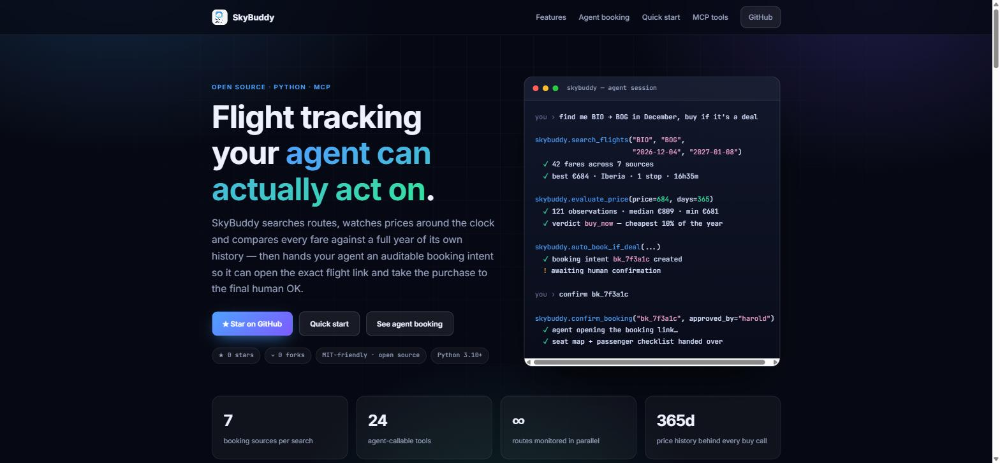
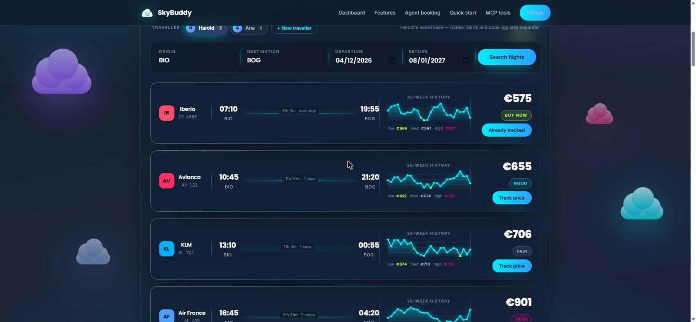
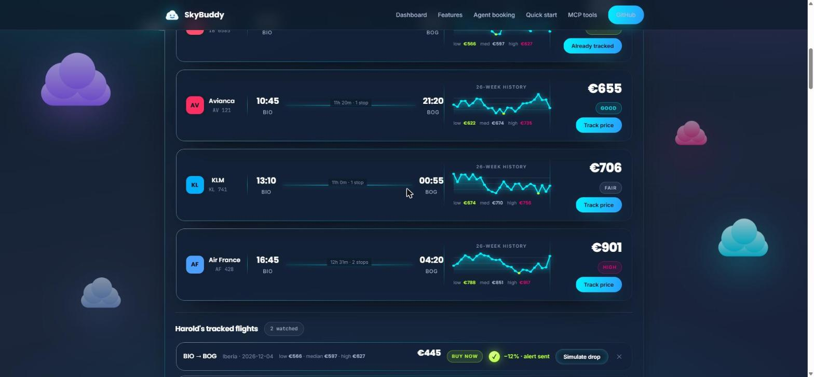
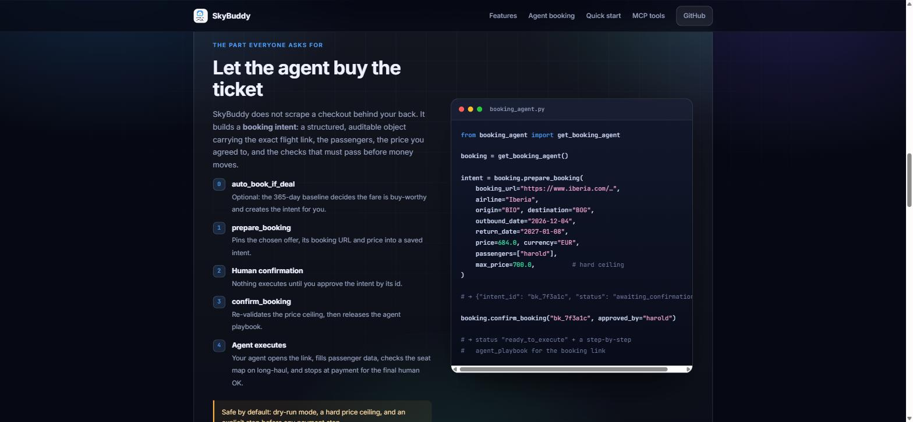
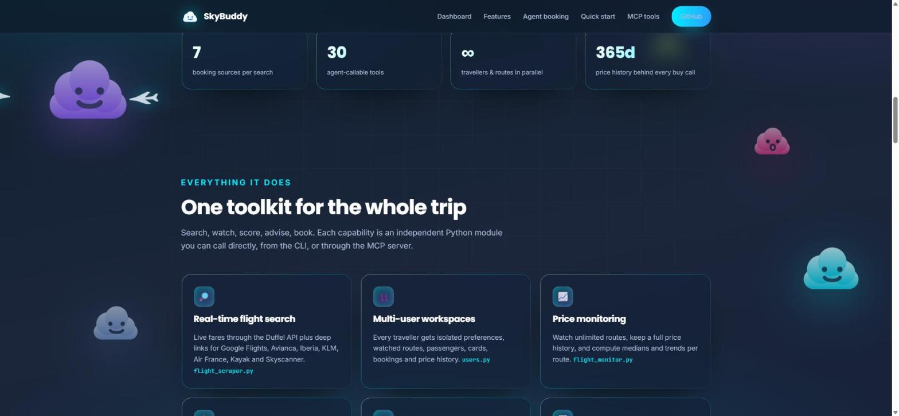
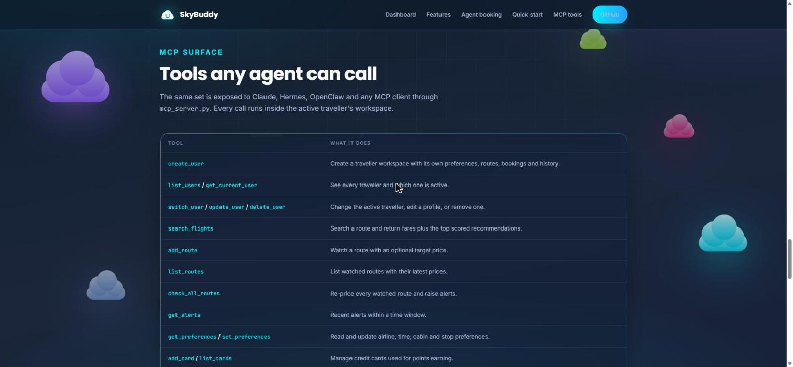

<p align="center">
  
</p>

<h1 align="center">SkyBuddy</h1>

<p align="center">
  <strong>Flight tracking your agent can actually act on.</strong><br>
  Search fares, watch routes, compare every price against a year of history —
  then hand any MCP agent an auditable booking intent for the exact flight link.<br>
  One isolated travel workspace per traveller.
</p>

<p align="center">
  <a href="https://skybuddy-ochre.vercel.app"><strong>Live site →</strong></a> ·
  <a href="#quick-start">Quick start</a> ·
  <a href="#5-agent-booking-trigger">Agent booking</a> ·
  <a href="#mcp-tool-reference">MCP tools</a>
</p>

<p align="center">
  <a href="https://skybuddy-ochre.vercel.app"></a>
  
  <a href="https://github.com/HaroldMate1/SkyBuddy/stargazers"></a>
  <a href="https://github.com/HaroldMate1/SkyBuddy/network/members"></a>
  <a href="https://github.com/HaroldMate1/SkyBuddy/commits/main"></a>
  <a href="https://github.com/HaroldMate1/SkyBuddy/actions/workflows/tests.yml"></a>
  
  
</p>

<p align="center">
  <a href="https://skybuddy-ochre.vercel.app">
    
  </a>
</p>

---

## Table of contents

- [What SkyBuddy does](#what-skybuddy-does)
- [The web app](#the-web-app)
- [Quick start](#quick-start)
- [Configuration](#configuration)
- [Features in depth](#features-in-depth)
  - [0. Travellers (multi-user)](#0-travellers-multi-user)
  - [1. Flight search](#1-flight-search)
  - [2. Price monitoring and alerts](#2-price-monitoring-and-alerts)
  - [3. Recommendation engine](#3-recommendation-engine)
  - [4. 365-day price baseline and buy signal](#4-365-day-price-baseline-and-buy-signal)
  - [5. Agent booking trigger](#5-agent-booking-trigger)
  - [6. Seat selection](#6-seat-selection)
  - [7. Loyalty, points and passengers](#7-loyalty-points-and-passengers)
  - [8. Flexible-date Google Flights sweeps](#8-flexible-date-google-flights-sweeps)
- [MCP tool reference](#mcp-tool-reference)
- [Python API reference](#python-api-reference)
- [Deploying and configuring the web app](#deploying-and-configuring-the-web-app)
- [Measuring usage](#measuring-usage)
- [Files and data](#files-and-data)
- [Environment variables](#environment-variables)
- [Testing](#testing)
- [Roadmap](#roadmap)
- [Contributing, license, support](#contributing-license-support)

---

## What SkyBuddy does

SkyBuddy is a production-grade flight toolkit written in plain Python. Every capability is an
independent module you can call from the CLI, from Python, or through the bundled MCP server —
so Claude, Hermes, OpenClaw or your own agent all get the same 30 tools.

| | Capability | Module |
|---|---|---|
| 🌐 | **Live web app** — sign-in, tracked flights stored online, nightly checks, email alerts | `web/`, `api/`, `server/` |
| 👥 | **A separate workspace per traveller** — routes, alerts, bookings, history | `users.py` |
| 🔎 | Real-time search across Duffel plus 7 booking sources | `flight_scraper.py`, `duffel_client.py` |
| 📈 | Unlimited watched routes with full price history | `flight_monitor.py`, `preferences.py` |
| 🔔 | Target-price, below-median and price-drop alerts | `alerts.py` |
| 🧠 | Transparent 0–100 flight scoring with written reasons | `recommendations.py` |
| 📉 | **365-day baseline: lowest, median, highest, and a buy/wait verdict** | `price_baseline.py` |
| 🎫 | **Booking intents an agent can execute on the flight link** | `booking_agent.py` |
| 💺 | Seat-map workflow across FlightAware, SeatMaps and 4 more sites | `seat_advisor.py` |
| 📅 | Flexible-date Google Flights sweeps, both baggage modes | `google_flights_monitor.py` |
| 💳 | Credit cards, loyalty balances and points estimation | `loyalty_cards.py` |
| 🧳 | Traveller profiles ready for checkout | `passenger_profiles.py` |
| 📊 | Fare history store and rendered dashboard | `fare_history.py`, `dashboard.py` |
| 🤖 | One MCP surface for every agent | `mcp_server.py`, `agent_integration.py` |

---

## The web app

Live at **[skybuddy-ochre.vercel.app](https://skybuddy-ochre.vercel.app)**.

Signed out, it is an interactive preview. Signed in, it is the real thing:

- **Magic-link sign-in** through Supabase Auth — no passwords anywhere.
- **Airport and city autocomplete** on the search fields, over 3,270 airports
  with scheduled service; type `bilb`, `new york` or `JFK`.
- **Live fares** from Duffel, fetched server-side so the API key never reaches
  the browser.
- **Tracked flights stored per account**, with every observed price kept, so the
  low / median / high on each card is your own recorded history.
- **A nightly check** (Vercel Cron) that re-prices every tracked route.
- **Email alerts** through Resend when your target is met, a new low is set, or
  the fare drops 10%+ since the last check.

Setup — Supabase, Duffel, Resend and the environment variables — is documented
step by step in **[docs/web-app-setup.md](docs/web-app-setup.md)**. Deep royal-blue to indigo gradient, glassmorphic panels, neon
cyan and magenta accents, drifting clouds and a paper plane looping across the sky.
See [Deploying the website to Vercel](#deploying-the-website-to-vercel).

<p align="center">
  
</p>

<p align="center"><em>Results — every fare carries its 26-week trend and its recorded low, median and high.</em></p>

<p align="center">
  
</p>

<p align="center"><em>Tracked flights — per traveller, with the price-drop alert animation.</em></p>

<p align="center">
  
</p>

<p align="center"><em>Agent booking — how the purchase trigger works, and what stops it.</em></p>

<p align="center">
  
</p>

<p align="center"><em>Features — every capability, mapped to the module that implements it.</em></p>

<p align="center">
  
</p>

<p align="center"><em>MCP surface — the 30 tools any agent can call.</em></p>

---

## Quick start

```bash
git clone https://github.com/HaroldMate1/SkyBuddy.git
cd SkyBuddy
pip install -r requirements.txt

# optional: live fares through Duffel
export DUFFEL_API_KEY="your_key_here"
```

```bash
# 1 · create a workspace for each traveller (optional — a default one exists)
python scripts/users.py create --user harold --display-name "Harold Mateo" --home-airport BIO
python scripts/users.py create --user ana --display-name "Ana"
python scripts/users.py switch --user harold

# 2 · search a route (uses config/search_config.json, or pass arguments)
python scripts/flight_scraper.py BIO BOG 2026-12-04 2027-01-08 EUR

# 3 · analyse the fares you have collected
python scripts/analyze_prices.py

# 4 · monitor the active traveller's routes and raise alerts
python scripts/flight_monitor.py --user harold

# 5 · ask what a good price actually is (365 days of history by default)
python scripts/price_baseline.py scan --origin BIO --destination BOG
python scripts/price_baseline.py evaluate --origin BIO --destination BOG --price 684

# 6 · let the history decide and create the purchase trigger
python scripts/price_baseline.py trigger \
  --origin BIO --destination BOG --outbound-date 2026-12-04 \
  --price 684 --airline Iberia --passenger harold \
  --booking-url "https://www.iberia.com/…"
```

From Python:

```python
import sys; sys.path.insert(0, "scripts")
from agent_integration import create_agent

sky = create_agent(user="harold")        # this traveller's workspace

result = sky.search_flights("BIO", "BOG", "2026-12-04", "2027-01-08")
print(result["price_history"])           # lowest / median / highest over 365 days

for rec in result["top_recommendations"]:
    print(rec["score"], rec["airline"], rec["price"], rec["verdict"], rec["booking_url"])
```

As an MCP server:

```bash
python scripts/mcp_server.py claude
```

```json
{
  "mcpServers": {
    "skybuddy": {
      "command": "python",
      "args": ["scripts/mcp_server.py", "claude"],
      "cwd": "/path/to/SkyBuddy"
    }
  }
}
```

---

## Configuration

Copy the example and edit it:

```bash
cp config/search_config.example.json config/search_config.json
```

```json
{
  "origin": "BIO",
  "destination": "BOG",
  "outbound_target_date": "2026-12-04",
  "return_target_date": "2027-01-08",
  "passengers": 1,
  "cabin": "economy",
  "currency": "EUR",
  "sources": ["Google Flights", "Avianca", "Iberia", "KLM", "Air France"]
}
```

Travel preferences live in `config/preferences.json` and feed the recommendation engine:

```json
{
  "preferred_airlines": ["Avianca", "Iberia"],
  "avoided_airlines": ["Frontier"],
  "preferred_departure_time": "morning",
  "max_flight_duration_hours": 18,
  "max_stops": 2,
  "preferred_cabin": "economy",
  "price_alert_threshold_percent": 10,
  "preferred_currency": "EUR"
}
```

---

## Features in depth

### 0. Travellers (multi-user)

Every traveller gets an isolated workspace. Nothing is shared: preferences, watched routes,
passengers, cards, alerts, booking intents and price history all live under that user.

```bash
python scripts/users.py create --user harold --display-name "Harold Mateo" \
  --email harold@example.com --home-airport BIO --currency EUR
python scripts/users.py create --user ana --display-name "Ana"

python scripts/users.py list                 # who exists, who is active
python scripts/users.py switch --user ana    # change the active traveller
python scripts/users.py show --user ana      # profile + workspace paths
python scripts/users.py update --user ana --home-airport MAD
python scripts/users.py delete --user ana --remove-data
```

```
config/users.json                     registry + active traveller
config/users/<user>/preferences.json  routes and preferences
config/users/<user>/passengers.json
config/users/<user>/cards.json
data/users/<user>/alerts.json
data/users/<user>/bookings.json
data/users/<user>/price_baseline.csv
```

Every CLI accepts `--user`, and `create_agent(user=...)` binds the whole toolkit to one
workspace. The built-in `default` traveller keeps SkyBuddy's original top-level paths, so
existing single-user installs keep working with no migration.

```python
harold = create_agent(user="harold")
ana = create_agent(user="ana")

harold.add_route("Colombia Trip", "BIO", "BOG", "2026-12-04", "2027-01-08", target_price=650)
ana.list_routes()          # {"routes": [], "total": 0} — separate workspace
```

From an agent, over MCP: `create_user`, `list_users`, `get_current_user`, `switch_user`,
`update_user`, `delete_user`.

### 1. Flight search

`flight_scraper.py` builds direct search URLs for **Google Flights, Avianca, Iberia, KLM, Air France,
Kayak and Skyscanner**. `duffel_client.py` adds live pricing when `DUFFEL_API_KEY` is set, returning
`Flight` objects with airline, price, duration, stops and a booking URL.

```bash
python scripts/flight_scraper.py               # uses the config file
python scripts/flight_scraper.py JFK LHR 2026-08-15 2026-08-25 GBP
```

### 2. Price monitoring and alerts

Watch as many routes as you like. Every check writes to the route's own history **and** to the
long-term baseline, so each run makes the next buy decision better informed.

```python
from flight_monitor import FlightMonitor

monitor = FlightMonitor()
monitor.search_and_add_route("Colombia Trip", "BIO", "BOG",
                             "2026-12-04", "2027-01-08", target_price=650)
alerts = monitor.monitor_all_routes()
```

Alert triggers:

| Trigger | Condition |
|---|---|
| Great deal | 15%+ below the historical median |
| Good deal | 10%+ below the historical median |
| Target reached | At or below your target price |
| Price drop | Significant fall from the previous observation |

### 3. Recommendation engine

Every fare is scored 0–100 and comes with its reasons:

```
Score = 40% price + 30% duration + 20% stops + 10% your preferences
```

### 4. 365-day price baseline and buy signal

`price_baseline.py` answers the only question that matters before buying: **is this price actually
good for this route?** It scans everything SkyBuddy has recorded — its own observation store, the
manual `price_observations.csv`, and the price history of watched routes — over a lookback window
that defaults to a **full year**, then turns a live fare into a verdict.

```bash
python scripts/price_baseline.py scan     --origin BIO --destination BOG            # baseline
python scripts/price_baseline.py record   --origin BIO --destination BOG --price 812 --airline Iberia
python scripts/price_baseline.py evaluate --origin BIO --destination BOG --price 684
```

```jsonc
// scan → the statistical baseline
{
  "days": 365, "samples": 121, "currency": "EUR",
  "minimum": 681.15, "p10": 700.28, "p25": 745.10,
  "median": 809.27, "p75": 872.40, "maximum": 958.80,
  "days_covered": 363, "recent_median_30d": 792.5,
  "trend": "falling", "trend_percent": -2.4,
  "confidence": "high",
  "buy_threshold": 700.28, "good_threshold": 745.10
}
```

Every quoted fare carries the recorded range, so the number always has context:

```python
result = sky.search_flights("BIO", "BOG", "2026-12-04", "2027-01-08")
result["price_history"]
# {"days": 365, "samples": 121, "lowest": 681.15, "median": 809.27, "highest": 958.8,
#  "p10": 700.28, "p25": 745.1, "p75": 872.4, "trend": "falling", "confidence": "high"}

result["flights"][0]["verdict"]              # "buy_now"
result["flights"][0]["vs_median_percent"]    # -15.5
```

`evaluate_price()` returns `lowest`, `median` and `highest` at the top level too, and
`verdict_for(price, baseline)` classifies a price against a baseline you already hold.

| Verdict | Meaning | Books? |
|---|---|---|
| `buy_now` | At/below your target, or in the cheapest 10% of the window | ✅ |
| `good` | In the cheapest 25% of the window | ✅ |
| `fair` | At or below the median, but no standout | ❌ |
| `wait` | Above the median; history says better is likely | ❌ |
| `high` | In the most expensive quarter of the year | ❌ |

Confidence is reported honestly: with fewer than 12 observations or under 30 days of coverage the
verdict is labelled `medium`/`low`, and with no history at all SkyBuddy says so instead of guessing.

### 5. Agent booking trigger

This is the part that lets an agent **buy the ticket on the flight link** — without SkyBuddy ever
scraping a checkout behind your back.

`booking_agent.py` creates a **booking intent**: a stored, auditable object carrying the exact flight
URL, the passengers, the price you agreed to, a hard ceiling, and the checks that must pass before
money moves.

```
prepare_booking → awaiting_confirmation
       ↓ (human approves by intent id)
confirm_booking → ready_to_execute   ← price ceiling re-checked here
       ↓
get_booking_playbook → in_progress   ← ordered steps for the agent
       ↓
mark_booking_executed → booked | failed
```

```bash
# 1 · create the intent from a flight link
python scripts/booking_agent.py prepare \
  --booking-url "https://www.iberia.com/…" \
  --airline Iberia --origin BIO --destination BOG \
  --outbound-date 2026-12-04 --return-date 2027-01-08 \
  --price 684 --currency EUR --passenger harold --max-price 700 \
  --flight-number "IB 6585" --aircraft "Airbus A350-900" --duration-minutes 620

# 2 · approve it explicitly
python scripts/booking_agent.py confirm --intent-id bk_7f3a1c --approved-by harold

# 3 · hand the playbook to your agent
python scripts/booking_agent.py playbook --intent-id bk_7f3a1c
```

From an agent:

```python
sky = create_agent()

search = sky.search_flights("BIO", "BOG", "2026-12-04", "2027-01-08")
intent = sky.prepare_booking_from_recommendation(
    search["top_recommendations"][0],
    origin="BIO", destination="BOG",
    outbound_date="2026-12-04", return_date="2027-01-08",
    passengers=["harold"], max_price=700,
)

sky.confirm_booking(intent["intent_id"], approved_by="harold", current_price=684.0)
playbook = sky.get_booking_playbook(intent["intent_id"])
```

Or fully automatic, driven by the year of history:

```python
sky.auto_book_if_deal(
    origin="BIO", destination="BOG",
    outbound_date="2026-12-04", return_date="2027-01-08",
    price=684.0, airline="Iberia",
    booking_url="https://www.iberia.com/…",
    passengers=["harold"], target_price=700,
)
# verdict buy_now → intent created, still awaiting your confirmation
```

**The playbook** the agent receives:

| Step | What the agent does | Abort condition |
|---|---|---|
| `open_link` | Opens the exact booking URL | Page redirects somewhere unrelated |
| `verify_itinerary` | Confirms route, dates, cabin, carrier | Anything differs from the intent |
| `verify_price` | Confirms the total is at or below the ceiling | Total above the ceiling |
| `fill_passengers` | Fills traveller data from stored profiles | Names cannot be matched to passports |
| `check_seats` | *(over 8 h)* aircraft check + cabin map before choosing seats | Configuration cannot be verified |
| `select_extras` | Applies agreed baggage/seats, declines upsells | Extras push the total over the ceiling |
| `stop_before_payment` | **Stops at payment and hands control back** | — |
| `record_result` | Stores the confirmation code in the audit trail | — |

**Safety rules, enforced in code:**

- An intent starts in `awaiting_confirmation`; nothing runs until a human approves it by id.
- `confirm_booking` re-validates the live price against the ceiling and refuses on breach.
- The playbook **stops before payment** unless payment authority was granted for that single intent.
- Non-HTTPS links and hosts outside the known booking sources are flagged in `warnings`.
- Every transition is appended to the intent's `history` for a complete audit trail.

### 6. Seat selection

`seat_advisor.py` implements a verification workflow rather than guessing a "best seat", because the
same aircraft model flies in different configurations.

**Primary workflow** (in order): **FlightAware** → confirm the operating aircraft, then **SeatMaps** →
inspect the airline-specific cabin map.

**Cross-check sources**, returned with the exact query to run on each site:

| Site | Role | Why |
|---|---|---|
| SeatGuru | cross-check | Colour-coded good/bad seat annotations per aircraft version |
| aeroLOPA | cross-check | High-accuracy airline-specific cabin diagrams |
| ExpertFlyer | availability | Live seat availability and alerts when a seat opens up |
| Flightradar24 | verify | Second source for the aircraft actually flying the route |
| Airline "manage my booking" | act | Where the seat is actually assigned |

Plus `seat_selection_actions()`: what to do at booking, after booking, and in the 24–48 h check-in
window when blocked exit rows and bulkheads are released.

```bash
python scripts/seat_advisor.py --airline Iberia --flight-number "IB 6131" \
  --aircraft "Airbus A350-900" --duration-minutes 610 --cabin economy
```

When a booking intent carries `duration_minutes` over 480, the seat check is inserted into the
booking playbook automatically. Full caveats: [docs/seat-advisory.md](docs/seat-advisory.md).

### 7. Loyalty, points and passengers

```python
from loyalty_cards import get_loyalty_manager

loyalty = get_loyalty_manager()
loyalty.add_card("amex-plat", "American Express", "Platinum", points_per_dollar=1.5)
loyalty.estimate_earnings(5000)     # → {"amex-plat": 7500.0}
```

```python
from passenger_profiles import get_passenger_manager

passengers = get_passenger_manager()
passengers.add_passenger("harold", "Harold", "Mateo", "1990-05-15", "M",
                         passport="AB123456", nationality="CO")
```

### 8. Flexible-date Google Flights sweeps

```bash
pip install -r requirements-monitor.txt
python scripts/google_flights_monitor.py --root /path/to/private-monitor \
  --origin BIO --destination BOG \
  --outbound-start 2026-12-02 --outbound-end 2026-12-06 \
  --return-start 2027-01-06 --return-end 2027-01-10
python scripts/apply_google_flights_results.py --root /path/to/private-monitor
```

Every date pair is queried in both baggage modes, and every pure or mixed carrier combination Google
returns is kept — no fixed airline list. Details: [docs/google-flights-monitor.md](docs/google-flights-monitor.md).

---

## MCP tool reference

All 30 tools are exposed by `scripts/mcp_server.py` to every agent type. Each one runs inside
the active traveller's workspace.

| Tool | Parameters | Returns |
|---|---|---|
| `create_user` | `user`, `display_name?`, `email?`, `home_airport?`, `currency?`, `make_active?` | New traveller workspace |
| `list_users` | — | Every traveller, and which is active |
| `get_current_user` | — | Active traveller and their file locations |
| `switch_user` | `user` | Makes that traveller active for later calls |
| `update_user` | `user`, profile fields | Updated profile |
| `delete_user` | `user`, `remove_data?` | Removes the traveller |
| `search_flights` | `origin`, `destination`, `outbound_date`, `return_date?`, `passengers?`, `cabin_class?` | Fares, the 365-day price range, and top-3 scored recommendations |
| `add_route` | `name`, `origin`, `destination`, `outbound_date`, `return_date?`, `target_price?` | Watched route confirmation |
| `list_routes` | — | Watched routes with stats |
| `check_all_routes` | — | Routes checked and alerts triggered |
| `get_alerts` | `hours?` | Recent alerts |
| `get_preferences` | — | Current preferences |
| `set_preferences` | any preference field | Updated preferences |
| `add_card` | `card_id`, `issuer`, `product`, `points_per_dollar` | Card added |
| `list_cards` | — | All cards |
| `add_loyalty_program` | `program`, `balance`, `tier?` | Program added |
| `estimate_earnings` | `flight_cost` | Points per card |
| `add_passenger` | `name`, `given_name`, `family_name`, `born_on`, `gender`, … | Profile added |
| `list_passengers` | — | All profiles |
| `prepare_booking` | `booking_url`, `airline`, `origin`, `destination`, `outbound_date`, `price`, `passengers?`, `max_price?`, `allow_payment?`, `flight_number?`, `aircraft?`, `duration_minutes?` | Intent `awaiting_confirmation` |
| `confirm_booking` | `intent_id`, `approved_by`, `current_price?`, `allow_payment?` | Intent `ready_to_execute` + playbook |
| `get_booking_playbook` | `intent_id` | Ordered agent steps + seat advisory |
| `mark_booking_executed` | `intent_id`, `confirmation_code?`, `amount_paid?`, `success?` | Final intent state |
| `cancel_booking` | `intent_id`, `reason?` | Cancelled intent |
| `list_bookings` | `status?` | Intents and audit trail |
| `get_price_baseline` | `origin`, `destination`, `days?`, `outbound_date?` | Lowest, percentiles, median, highest, trend, confidence |
| `evaluate_price` | `origin`, `destination`, `price`, `days?`, `target_price?` | Verdict, percentile, lowest/median/highest, reasons |
| `auto_book_if_deal` | `origin`, `destination`, `outbound_date`, `price`, `booking_url`, `airline?`, `passengers?`, `target_price?`, `max_price?` | Assessment, and the intent if it wins |
| `record_price_observation` | `origin`, `destination`, `price`, `currency?`, `airline?`, … | Stored observation |
| `get_seat_advisory` | `airline`, `duration_minutes`, `aircraft?`, `flight_number?`, `cabin?` | Workflow, sources, tips, actions |

---

## Python API reference

Every public function, grouped by module. Add `scripts/` to `sys.path` (or run from `scripts/`).

<details open>
<summary><strong>users.py</strong> — traveller workspaces</summary>

`get_user_manager()` → `UserManager` · `get_workspace(user)` → `Workspace` ·
`build_workspace(user_id, root)` · `slugify(name)`

`UserManager`: `create_user`, `get_user`, `list_users`, `switch_user`, `update_user`,
`delete_user`, `workspace`, `current`, `save`

Dataclasses: `UserProfile`, `Workspace` (`ensure()`, `as_dict()`).
Constant: `DEFAULT_USER`.

CLI: `create · list · switch · show · update · delete`
</details>

<details open>
<summary><strong>agent_integration.py</strong> — the unified agent surface</summary>

`create_agent(agent_type, user)` → `SkyBuddyAgent`; `AgentType.HERMES | OPENCLAW | CLAUDE | GENERIC`

`SkyBuddyAgent`: `create_user`, `list_users`, `get_current_user`, `switch_user`, `update_user`,
`delete_user`, `use_user`, `search_flights`, `add_route`, `list_routes`, `check_all_routes`, `get_alerts`,
`get_preferences`, `set_preferences`, `add_card`, `list_cards`, `add_loyalty_program`,
`estimate_earnings`, `add_passenger`, `list_passengers`, `prepare_booking`,
`prepare_booking_from_recommendation`, `confirm_booking`, `get_booking_playbook`,
`mark_booking_executed`, `cancel_booking`, `list_bookings`, `get_price_baseline`,
`record_price_observation`, `evaluate_price`, `auto_book_if_deal`, `get_seat_advisory`,
`register_callback`, `trigger_callback`, `to_json`
</details>

<details>
<summary><strong>booking_agent.py</strong> — the purchase trigger</summary>

`get_booking_agent(user)` → `BookingAgent` · `BookingIntent` dataclass (with `log()`)

`BookingAgent`: `prepare_booking`, `confirm_booking`, `build_playbook`, `get_booking_playbook`,
`mark_executed`, `cancel_booking`, `list_bookings`, `get_booking`, `save`

Constants: `AWAITING`, `READY`, `IN_PROGRESS`, `BOOKED`, `CANCELLED`, `FAILED`, `KNOWN_BOOKING_DOMAINS`

CLI: `prepare · confirm · playbook · executed · cancel · list · show`
</details>

<details>
<summary><strong>price_baseline.py</strong> — history and buy signal</summary>

`get_price_baseline(user)` → `PriceBaseline` · `get_buy_engine(user)` → `BuyDecisionEngine`

`PriceBaseline`: `record_price`, `record_many`, `collect`, `build`, `evaluate`

Module helpers: `verdict_for(price, baseline, target_price)`, `price_range(baseline)`

`BuyDecisionEngine`: `auto_book_if_deal`

Dataclasses: `PriceObservation`, `Baseline`.
Constants: `DEFAULT_LOOKBACK_DAYS` (365), `MIN_CONFIDENT_SAMPLES`, `VERDICT_BUY`, `VERDICT_GOOD`,
`VERDICT_FAIR`, `VERDICT_WAIT`, `VERDICT_HIGH`, `BUY_WORTHY`

CLI: `scan · record · evaluate · trigger`
</details>

<details>
<summary><strong>seat_advisor.py</strong> — seat intelligence</summary>

`build_seat_advisory(...)`, `cli_payload(...)`, `workflow_steps`, `seat_map_sources`,
`cross_check_sources`, `seat_selection_actions`, `selection_tips`,
`flightaware_url`, `flightaware_query`, `seatmaps_url`, `seatmaps_query`,
`seatguru_url`, `aerolopa_url`, `expertflyer_url`, `flightradar24_url`

Constant: `LONG_HAUL_THRESHOLD_MINUTES` (480)
</details>

<details>
<summary><strong>flight_monitor.py · flight_scraper.py · duffel_client.py</strong> — search and watching</summary>

`FlightMonitor`: `monitor_all_routes`, `monitor_route`, `search_and_add_route`, `get_route_stats`,
`print_monitoring_report`

`flight_scraper`: `load_config`, `parse_args`, `generate_search_urls`, and one generator per source —
`generate_google_flights_url`, `generate_avianca_url`, `generate_iberia_url`, `generate_klm_url`,
`generate_air_france_url`, `generate_kayak_url`, `generate_skyscanner_url`

`duffel_client`: `get_duffel_client()` → `DuffelClient.search_flights`; dataclasses `Flight`,
`FlightSearchResult`
</details>

<details>
<summary><strong>preferences.py · alerts.py · recommendations.py</strong> — state and scoring</summary>

`get_preferences_manager()` → `PreferencesManager`: `add_watched_route`, `remove_watched_route`,
`update_price_history`, `should_alert`, `get_all_watched_routes`, `update_preferences`, `save`
— dataclasses `FlightPreferences`, `WatchedRoute`

`get_alerts_manager()` → `AlertsManager`: `create_alert`, `get_recent_alerts`, `get_alerts_by_route`,
`format_alert_message`, `send_email_alert`, `print_alert`, `save_alerts` — dataclass `PriceAlert`

`get_recommendation_engine()` → `RecommendationEngine`: `score_flight`, `recommend_flights`,
`format_recommendation`, `print_recommendations` — dataclass `FlightRecommendation`
</details>

<details>
<summary><strong>loyalty_cards.py · passenger_profiles.py</strong> — traveller data</summary>

`get_loyalty_manager()` → `LoyaltyManager`: `add_card`, `remove_card`, `list_cards`,
`add_loyalty_program`, `update_balance`, `list_programs`, `get_total_points`, `can_book_with_points`,
`estimate_earnings`, `print_summary` — dataclasses `CreditCard`, `LoyaltyProgram`

`get_passenger_manager()` → `PassengerManager`: `add_passenger`, `get_passenger`, `list_passengers`,
`remove_passenger`, `add_frequent_flyer`, `get_passengers_for_booking` — dataclass `PassengerProfile`
</details>

<details>
<summary><strong>Analysis, history and presentation</strong></summary>

`analyze_prices.py` / `analyze_prices_v2.py`: `load_observations`, `main` — dataclass `Observation`

`fare_history.py`: `command_record`, `command_record_airline`, `command_status`, `command_should_alert`,
`command_mark_sent`, `summary`, `render_graph`, `load_rows`, `write_rows`, `load_state`, `write_state`

`dashboard.py`: `render_dashboard`, `parse_iso`, `eur`, `short_date`

`google_flights_monitor.py`: `collect_google_flights`, `run_query`, `itinerary_summary`, `date_range`,
`carrier_name`, `airline_name`

`apply_google_flights_results.py`: `run`, `google_url`, `details`, `fare`

`flight_formatter.py`: `get_formatter()` → `FlightFormatter`: `format_time`, `format_duration`,
`format_leg`, `format_itinerary`, `format_flight_option`, `format_search_results`, `print_flight_deals`
— dataclasses `FlightLeg`, `BookingItinerary`
</details>

<details>
<summary><strong>Agent adapters</strong></summary>

`mcp_server.py`: `SkyBuddyMCPServer`: `list_tools`, `call_tool`, `handle_request`, `start`

`hermes_adapter.py`: `create_hermes_adapter()` → `HermesAdapter`: `search_and_recommend`,
`monitor_routes`, `check_prices`, `prepare_booking`, `check_loyalty_points`, `estimate_earnings`,
`manage_trips`, `register_action`

`openclaw_adapter.py`: `create_openclaw_adapter()` → `OpenClawAdapter`: `get_schema`,
`process_tool_call`, `to_mcp_response`, `validate_input`; plus `OpenClawMCPServer.handle_request`
</details>

---

## Deploying and configuring the web app

The site is static and the API is a handful of dependency-free serverless
functions, so there is no build step.

1. Push this repository to GitHub.
2. In Vercel: **Add New → Project → Import** `HaroldMate1/SkyBuddy`.
3. Leave the defaults — `vercel.json` sets framework *none*, no build command,
   `outputDirectory: "web"`, the `/api` functions and the daily cron.
4. **Deploy**, then add the environment variables from
   [docs/web-app-setup.md](docs/web-app-setup.md) and redeploy.

Or from the CLI:

```bash
npm i -g vercel
vercel --prod
```

### What lives where

| Path | Role |
|---|---|
| `web/` | The static site: markup, design system, demo dashboard, autocomplete |
| `web/live.js` | Live mode — Supabase auth, tracked flights, live search |
| `web/data/airports.json` | 3,270 airports for the search autocomplete |
| `api/config.js` | Public runtime config + feature flags for the browser |
| `api/search.js` | Authenticated live fare search (Duffel, server-side) |
| `api/check.js` | "Check now" for one tracked flight |
| `api/cron/check-prices.js` | The nightly sweep that raises and emails alerts |
| `server/` | Shared Duffel, Supabase REST, alert-rule and email helpers |
| `supabase/schema.sql` | Tables, row-level security and the signup trigger |

### Environment variables

```bash
SUPABASE_URL=                 # project URL
SUPABASE_ANON_KEY=            # public key, safe in the browser
SUPABASE_SERVICE_ROLE_KEY=    # server only — used by the cron sweep
DUFFEL_API_KEY=               # live fares
RESEND_API_KEY=               # alert emails
ALERT_FROM_EMAIL="SkyBuddy <onboarding@resend.dev>"
CRON_SECRET=                  # protects /api/cron/check-prices
```

Local preview: `vercel dev` (full app), or
`python -m http.server 8899 --directory web` for the signed-out experience.

---

## Measuring usage

| Signal | Where | Notes |
|---|---|---|
| **Repo visits** | The visits badge at the top of this README | Counts README/badge loads, per `page_id=HaroldMate1.SkyBuddy` |
| **Stars / forks** | Badges above, and live on the website hero | Fetched from the GitHub API by `web/app.js` |
| **Clones & unique visitors** | GitHub → **Insights → Traffic** | Owner-only; 14-day rolling window |
| **Website traffic** | Vercel → Project → **Analytics** | Enable in the Vercel dashboard; no code change needed |
| **Release downloads** | GitHub → Releases | Per-asset counters |

> The visits badge is a third-party image service. If it ever fails to load, the badge simply does not
> render — nothing else in the README is affected.

---

## Files and data

```
SkyBuddy/
├── web/                       # Vercel landing page (index.html, styles.css, app.js, logo)
├── vercel.json                # static deploy config
├── scripts/                   # all Python modules (see the API reference)
├── tests/                     # unittest suite, run in CI
├── docs/                      # seat advisory + Google Flights monitoring guides
├── config/
│   ├── search_config.json     # route configuration
│   ├── users.json             # traveller registry + active traveller
│   ├── users/<user>/          # preferences, passengers, cards per traveller
│   ├── preferences.json       # default workspace: preferences and watched routes
│   ├── passengers.json        # default workspace: traveller profiles
│   └── cards.json             # default workspace: cards and loyalty programs
├── data/
│   ├── users/<user>/          # alerts, bookings and price history per traveller
│   ├── price_baseline.csv     # default workspace: 365-day observation store
│   ├── price_observations.csv # manual/collector observations
│   ├── bookings.json          # default workspace: booking intents
│   └── alerts.json            # default workspace: alert history
└── assets/                    # logo and website screenshots
```

Everything under `config/` and `data/` is git-ignored — your travel data stays local.

---

## Environment variables

```bash
DUFFEL_API_KEY=your_api_key          # live flight search

ALERT_EMAIL_FROM=you@gmail.com       # optional email alerts
ALERT_EMAIL_PASSWORD=app_password
ALERT_EMAIL_TO=recipient@example.com
```

---

## Testing

```bash
python -m unittest discover -s tests -v
```

The suite covers the seat advisory, fare history, Google Flights collection, the booking-intent
lifecycle (ceilings, confirmation, payment stops, audit trail), the price baseline (windowing,
verdicts, auto-trigger) and traveller workspaces (isolation, switching, deletion). CI runs it on every push via `.github/workflows/tests.yml`.

---

## Roadmap

- [ ] Web dashboard backed by the baseline store
- [ ] Email digest of the week's verdicts
- [ ] Native Kayak / Skyscanner APIs
- [ ] Carbon footprint per itinerary
- [ ] Award-flight calculator

---

## Contributing, license, support

Contributions are welcome — see [CONTRIBUTING.md](CONTRIBUTING.md).
Issues and ideas: [GitHub Issues](https://github.com/HaroldMate1/SkyBuddy/issues).

Open source, free to use for personal travel planning.
Built by [Harold Mateo](https://github.com/HaroldMate1).

---

<p align="center"><strong>SkyBuddy — track it, score it, book it.</strong> ✈️</p>
